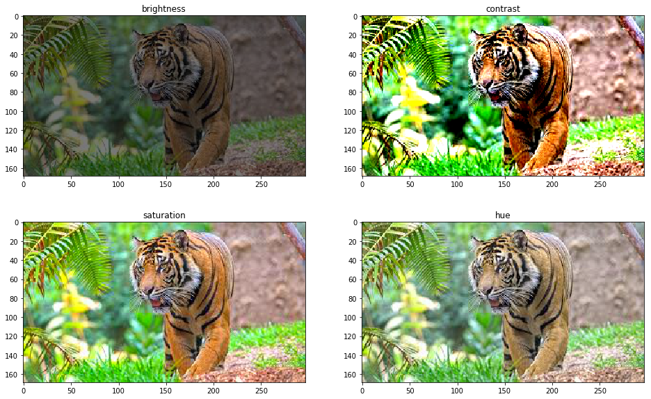

# bnomial DS question of the day

## Tuesday, September 17th 2024

### Question:
__Brielle wants to build a machine learning model that will use traffic violations to predict how to distribute the city's police force.__

__She wants the model to predict the areas where new violations are likely to occur so the department can reinforce the security around those streets.__

__Which of the following is a potential problem that Brielle should consider?__

### Possible Asnwers:

    • There won't be any reliable way to evaluate this model. 
    
<details> <summary>Answer</summary><span style="color:red">INCORRECT</span></details>

    • The model may suffer from survivorship bias.

<details> <summary>Answer</summary><span style="color:red">INCORRECT</span></details>


    • The model may suffer from decline bias.

<details> <summary>Answer</summary><span style="color:red">INCORRECT</span></details>

    • The model may create a positive feedback loop.

<details> <summary>Answer</summary><span style="color:green">CORRECT</span></details>

### Explanation:

Evaluating this model doesn't need to be complicated. Assuming that Brielle uses a Supervised Learning approach, she will have several options to assess the quality of the model predictions. Therefore, the first choice is incorrect.

[Survivorship bias]("https://en.wikipedia.org/wiki/Survivorship_bias") is when we concentrate on samples that made it past a selection process and ignore those that did not. Nothing in the problem statement indicates that Brielle's model will suffer from this problem.

[Decline bias]("https://en.wikipedia.org/wiki/Declinism") refers to the tendency to compare the past to the present, leading to the assumption that things are worse or becoming worse simply because change is occurring. The third choice is not a correct answer either.

Finally, this model may create a [positive feedback loop]("https://en.wikipedia.org/wiki/Positive_feedback"). The more you patrol a neighborhood, the more traffic violations you'll find. Communities with no police force will never report any violations, while heavily patrolled communities will have the lion's share of transgressions.

The model will use that data and make the problem worse: it will predict that new violations will happen in already problematic areas, sending more police to those communities at the expense of areas with lower reports. A few rounds of this, and you'll have most reports from a few places while violations are rampant everywhere.

### Recommended reading:

Check the description of a ["Positive Feedback Loop"]("https://en.wikipedia.org/wiki/Positive_feedback") in Wikipedia.

["How Positive Feedback Loops Are Hurting AI Applications"]("https://levelup.gitconnected.com/how-positive-feedback-loops-are-hurting-ai-applications-6eae0304521c") is an excellent article explaining the dangers of positive feedback loops in machine learning.

### Wednesday, September 18th 2024

### Question:
__Arianna is trying to learn how Convolutional Neural Networks work, so she decided to copy an online Keras example to start from somewhere.__

__Here is the core of the code she put together:__

``` 
model = keras.Sequential([
    keras.Input(shape=(28, 28, 1)),
    layers.Conv2D(32, kernel_size=(3, 3), activation="relu"),
    layers.MaxPooling2D(pool_size=(2, 2)),
    layers.Conv2D(64, kernel_size=(3, 3),mmmm activation="relu"),
    layers.MaxPooling2D(pool_size=(2, 2)),
    layers.Flatten(),
    layers.Dropout(0.5),
    layers.Dense(10, activation="softmax"),
])

```

__Based on the above code fragment, what are the correct statements regarding each layer's parameters (weights and biases)?__

### Possible Asnwers:


* The first convolutional layer has a total of 21,632 parameters.

<details> <summary>Answer</summary><span style="color:red">INCORRECT</span></details>

* The first max pooling layer has a total of 5,408 parameters.

<details> <summary>Answer</summary><span style="color:red">INCORRECT</span></details>

* The second convolutional layer has a total of 18,496 parameters.

<details> <summary>Answer</summary><span style="color:green">CORRECT</span></details>

* The fully-connected layer has a total of 1,600 parameters.

<details> <summary>Answer</summary><span style="color:green">CORRECT</span></details>

### Explanation:

We can compute the number of parameters of a convolutional layer using the following formula:

```
parameters = k * (f * h * w + 1)
```

Where k corresponds to the number of output filters from this layer, f corresponds to the number of filters coming from the previous layer, h corresponds to the kernel height and w to the kernel width. The value 1 corresponds to the bias parameter related to each filter. Here is the complete calculation for the first convolutional layer:

```
parameters = k * (f * h * w + 1)
parameters = 32 * (1 * 3 * 3 + 1) = 320
```

Max pooling layers don't have any parameters because they don't learn anything. The input to the first max pooling layer is 26x26x32, but the layer doesn't have any weights or biases associated with it.

The second convolutional layer does have 18,496 parameters. Let's check:

```
parameters = k * (f * h * w + 1)
parameters = 64 * (32 * 3 * 3 + 1) = 18,496
```

Finally, the fully-connected layer has 1,600 parameters. To compute this, we need to calculate the size of each layer to understand the input to the fully-connected layer:

* Input: 28x28x1 = 784
* Conv2D: 26x26x32 = 21,632
* MaxPool2D: 13x13x32 = 5,408
* Conv2D: 11x11x64 = 7,744
* MaxPool2D: 5x5x64 = 1,600

### Recommended reading:

Notice that the above values differ from the number of learnable parameters of each layer, but they are essential to understanding the size of the input to the fully-connected layer.
Recommended reading

Check ["Understanding and Calculating the number of Parameters in Convolution Neural Networks (CNNs)"]("https://towardsdatascience.com/understanding-and-calculating-the-number-of-parameters-in-convolution-neural-networks-cnns-fc88790d530d) for instructions on how to compute the number of learnable parameters.

["Simple MNIST convnet"]("https://keras.io/examples/vision/mnist_convnet/) is a Keras example showing this particular code fragment.

### Thurdats, September 19th 2024

### Question:

__Esther had an excellent model already, but she had the budget to experiment a bit more and improve its results.__

__She was building a deep network to classify pictures. From the beginning, her Achilles' heel has been the size of her dataset. One of her teammates recommended she use a few data augmentation techniques.__

__Esther was all-in. Although she wasn't sure about the advantages of data augmentation, she was willing to do some research and start using it.__

__Which of the following statements about data augmentation are true?__


### Possible Asnwers:

* Esther can use data augmentation to expand her training dataset and assist her model in extracting and learning features regardless of their position, size, rotation, etc.

<details> <summary>Answer</summary><span style="color:green">CORRECT</span></details>

* Esther can use data augmentation to expand the test dataset, have the model predict the original image plus each copy, and return an ensemble of those predictions.

<details> <summary>Answer</summary><span style="color:green">CORRECT</span></details>

* Esther will benefit from the ability of data augmentation to act as a regularizer and help reduce overfitting.

<details> <summary>Answer</summary><span style="color:green">CORRECT</span></details>

* Esther has to be careful because data augmentation will reduce the ability of her model to generalize to unseen images.

<details> <summary>Answer</summary><span style="color:red">INCORRECT</span></details>

### Explanation:

One significant advantage of data augmentation is its ability to make a model resilient to variations in the data. For example, assuming we are working with images, we can use data augmentation to generate synthetic copies of each picture and help the model learn features regardless of where and how they appear.

A few popular augmentation techniques when working with images are small rotations, horizontal and vertical flipping, turning the picture to grayscale, or cropping the image at different scales. The [following example]("https://www.v7labs.com/blog/data-augmentation-guide") shows four versions of an image generated by changing the original picture's brightness, contrast, saturation, and hue:



Data augmentation is also helpful during testing time: Test-Time Augmentation is a technique where we augment samples before running them through a model, then average the prediction results. Test-Time Augmentation often results in better predictive performance.

Instead of predicting an individual sample from the test set, we can augment it and run each copy through the model. Esther is working on a classification problem, so her model will output a softmax vector for each sample. She can then average all these vectors and use the result to choose the correct class representing the original sample.

Using data augmentation, Esther can reduce overfitting and help her model perform better on unseen data. Data augmentation has a regularization effect. Increasing the training data through data augmentation decreases the model's variance and, in turn, increases the model's generalization ability. Therefore, the third choice is correct, but the fourth one is not.

### Recommended reading:

["The Essential Guide to Data Augmentation in Deep Learning"]("https://www.v7labs.com/blog/data-augmentation-guide") is an excellent article discussing data augmentation in detail.

Check ["Test-Time augmentation"]("https://articles.bnomial.com/test-time-augmentation") for an introduction that will help you make better predictions with your machine learning model.
