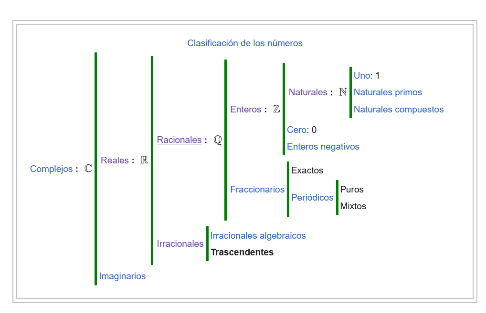

# Mathematical Notation for Computer Science
----------------
## Wednesday, September 18th 2024
-----------------
### Set of numbers:

#### Real Numbers: 

They are denoted by the uppercase R letter:

$$\mathbb{R}$$

The real numbers set includes the following: Rational numbers, Intergers, Irrational numbers and Trascendental numbers.

##### Rational Numbers:

Denoted by $$\mathbb{Q}$$ (coming from the latin *quotiens*), they are each number that can be represented as the quotient of two interger numbers. More exactly, they are the numbers that can be represented as the quotient of an interger and a natural positive number (that is, no 0 in the denominator as we cannot divide by 0; in general a/b = c means a = b×c. If b is zero, then a is also zero.)

(In other words, rational numbers are intergers.)

##### Natural Numbers: 

Represented by a capital
$$ \mathbb{N}$$
letter, the natural numbers are the set of numbers that can be used to count the elements of certain sets. 

Given two neighbour numbers, the one located on the right is called the *following* or *succesive* number. Therefore, this set of numbers is ordered and infinite.

The set of all natural numbers equal or less than a certain number *k*, that is, the set {1, 2, ..., k-1, k}, is called __Natural Succesion Segment__ and is denoted by [1,k] or just [k].

#### Imaginary Numbers:

##### Irrational Numbers:

A value that cannot be expressed as a fraction m/n, where 

$$ m, n \in \mathbb{Z} \quad \textrm{and} \quad n \not = 0 \quad \textrm{.}$$

That is, they are any real number that is not rational and their decimal representation is neither exact or periodic. 

We use a capital I to represent them: 
$$ \mathbb{I}$$

##### Trascendental Numbers:

It is a number that is not the root of any given algebraic equation (polynomial) with non-null interger (rational) coefficients. A Trascendental Number is not an algebraic number, as it is not the solution of any algebraic equation with rational coefficients.

### Algebra:

#### Polynomials:

An algebraic expression (expression meaning formula) formed by the sum of various monomials or *terms*, being each of the latters the product (multiplication) of:

* A constant coeffiecint *y* whose value is known.
* One or more variables (also known as indeterminates), not necessarily different from each other, obtaining this name as their values are not being given beforehande. These are usually denoted *x1*, *x2*, *xn* or also *x*, *y*, *z*, *n*

### Division vocabulary:

$$ a/b = c $$

* __Numerator:__  a
* __Denominator:__ b
* __Quotient:__ c

### Symbols:

__Belonging to:__

$$ \in $$

__For all:__

$$ \forall $$

For al x belonging to R:

$$\forall x \in \mathbb{R}$$

